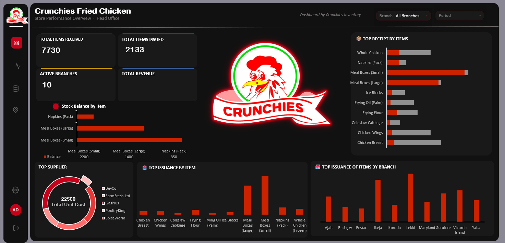

# Crunchies Fried Chicken – Store Performance Dashboard
A store inventory and supply performance dashboard built entirely in *Microsoft Excel*, styled to mirror the look and feel of a Power BI repo



---

## Project Overview

This repository contains an Excel-based dashboard that visualises store operations across **10 branches** of Crunchies Fried Chicken. The dashboard covers:

1. **Inventory KPIs** — Total items received, issued, and active branches at a glance.
2. **Stock & Supply Analysis** — Stock balance by item, top items received, and top issuance trends.
3. **Branch Performance** — Side-by-side comparison of issuance activity across all branches.
4. **Supplier Breakdown** — Donut chart showing supplier share by total unit cost.

---

## 📁 Repository Structure

```
Crunchies-Dashboard/
├── data           # contains files used for analysis
├── dashboard      # Screenshot of the completed dashboard and the completed dashboard and analysis
├── image          # images used in the dashboard
└── README.md      
```

---

## Getting Started

### 1. Clone the repo
```bash
git clone https://github.com/your-username/Store_Performance_Dashboard.git
cd Store_Performance_Dashboard
```

### 2. Open the Dashboard
- Open **`Store_Dashboard.xlsx`** in **Microsoft Excel** (2021 or later recommended).
- Use the **Branch** and **Period** slicers at the top right to filter the view.
- All charts update dynamically based on slicer selections.

---

## Dashboard Sections

| Section | Description |
|---|---|
| **KPI Cards** | Total Items Received, Total Items Issued, Active Branches |
| **Stock Balance by Item** | Horizontal bar chart of remaining stock per product |
| **Top Receipt by Items** | Dual-bar chart comparing items received store-wide |
| **Top Issuance by Item** | Vertical bar chart of most frequently issued items |
| **Top Issuance by Branch** | Branch-level breakdown of total items issued |
| **Top Supplier** | Donut chart of supplier share by unit cost |

---

## Tools Used

- **Microsoft Excel** — Pivot tables, charts, slicers, and conditional formatting
- No external tools, plugins, or code libraries used

---

## ⚠️ Disclaimer

> Crunchies Fried Chicken is used here as a design and portfolio sample only. I do not work for this company. All data, branch names, supplier names, and figures were **synthetically generated using Claude AI (Anthropic)** for demonstration purposes and do not represent any real business operations.

---

## Contributing

This repo was created as a personal portfolio project. If you have feedback or suggestions, feel free to open an issue or reach out directly.

---

## 📄 License

*This content is provided for portfolio and demonstration purposes only.*  
© 2026 | Prepared by George
